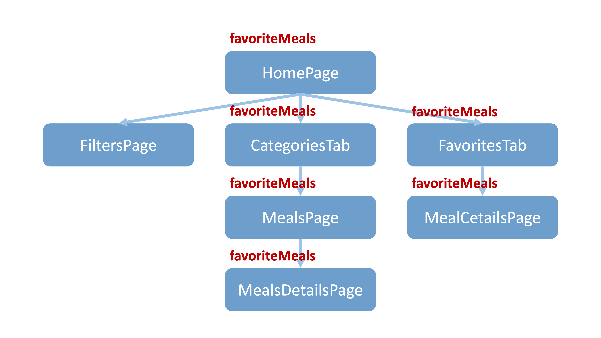
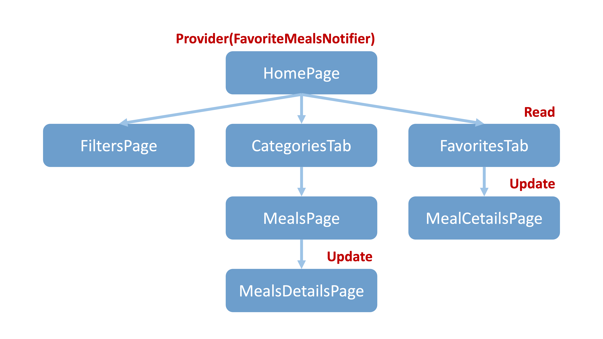
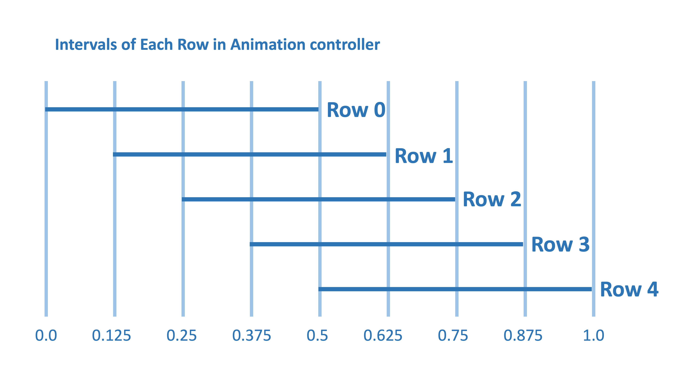

# Meals app with ProxyProvider & Staggered Animations 

In this project, users can access a Meals app with filter and favorite. The app uses `Provider` to manage the informations that are shared between different widgets. Additionally, using some flutter's `Animation` to create transformation effects.

# Features

### Using Provider and ProxyProvider

- We don't want to pass the favoritesMeals to the Pages and Tabs separately. Take favoriateMeals for example.
    
    

- Instead, using `Provider` and `ProxyProvider` to read and update the favoritesMeals.

    

### Staggered Animations

-  Using `StaggeredAnimation` to create a staggered animation effect in the CategoriesTab, which animates each row of categories with `easeOutCubic` effect.

    

- With the time interval for each row.

    - row 0: begins at 0.0 & ends at 0.5
    - ...
    - row n-1: begins at 0.5 & ends at 1.0

    

- Also, Adding a transformation effect on the star icon when the meal is favorited. 

    

# Resources

- [ProxyProvider](https://pub.dev/packages/provider#proxyprovider)
- [ChangeNotifierProxyProvider2](https://pub.dev/documentation/provider/latest/provider/ChangeNotifierProxyProvider2-class.html)
- [Staggered animation tutorial](https://docs.flutter.dev/ui/animations/staggered-animations)

